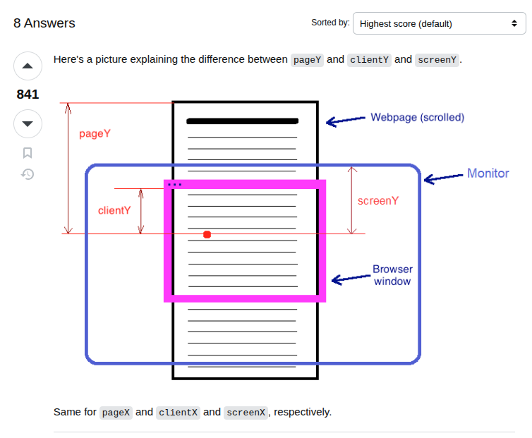

- draggable makes a div draggable (instead of highlighting when you click and drag)
- onDragStart fires ONCE when you begin to drag
- onDragEnter fires ONCE when the dragged div enters another.
- onDragOver fires CONTINUOUSLY when dragging over a div
- onDrop fires when the mouse click is released
- captrue vi tri
- 
- // By default, data/elements cannot be dropped in other elements. To allow a drop, we must prevent the default handling of the element
  document.addEventListener("dragover", function(event) {
  event.preventDefault();
  });

behavior: 
1. khi kéo thì nếu chưa vào vùng drag được thì thả tay ra phải trở về vị trí cũ 
2. khi đang trong quá trình drag có thể kéo đến các vị trí khác => vị trí các item khác thay đổi => cần lưu lại vị trí ban đầu của các item để tính toán việc item nào di chuyển sang bên nào
items: [1,2,3,4,5,6,7,8,9,10] = original items
index: [0,1,2,3,4,5,6,7,8,9]

step 1: tìm vị trí của item đang được drag và item target
step 2: loop qua tất cả các item
Chia case để tính xem item được đẩy sang trái or phải
Case 1: item đẩy sang bên trái
- Nếu index của item được kéo < index của item target
=> những item có index > index của item được kéo và index <= index của item target thì đẩy sang bên trái

Case 2: item đẩy sang bên phải
- Nếu index của item được kéo > index của item target 
=> những item có index >= index item target và index < item được drag sẽ đẩy sang bên phải